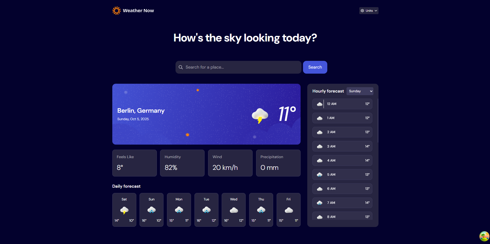
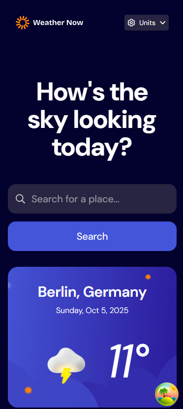

# Frontend Mentor - Weather app solution

This is a solution to the [Weather app challenge on Frontend Mentor](https://www.frontendmentor.io/challenges/weather-app-K1FhddVm49). Frontend Mentor challenges help you improve your coding skills by building realistic projects.

## Table of contents

- [Overview](#overview)
  - [The challenge](#the-challenge)
  - [Screenshot](#screenshot)
  - [Links](#links)
- [My process](#my-process)
  - [Built with](#built-with)
  - [What I learned](#what-i-learned)
  - [Continued development](#continued-development)
  - [Useful resources](#useful-resources)
- [Author](#author)
- [Acknowledgments](#acknowledgments)

## Overview

### The challenge

Users should be able to:

- Search for weather information by entering a location in the search bar
- View current weather conditions including temperature, weather icon, and location details
- See additional weather metrics like "feels like" temperature, humidity percentage, wind speed, and precipitation amounts
- Browse a 7-day weather forecast with daily high/low temperatures and weather icons
- View an hourly forecast showing temperature changes throughout the day
- Switch between different days of the week using the day selector in the hourly forecast section
- Toggle between Imperial and Metric measurement units via the units dropdown
- Switch between specific temperature units (Celsius and Fahrenheit) and measurement units for wind speed (km/h and mph) and precipitation (millimeters) via the units dropdown
- View the optimal layout for the interface depending on their device's screen size
- See hover and focus states for all interactive elements on the page

### Screenshot




### Links

- Solution URL: [Add solution URL here](https://www.frontendmentor.io/solutions/responsive-weather-app-react-tailwind-zustand-tanstack-query-jsle1yRasQ)
- Live Site URL: [Add live site URL here](https://weather-now-fm.netlify.app/)

## My process

### Built with

- Semantic HTML5 markup
- CSS custom properties
- Flexbox
- CSS Grid
- Mobile-first workflow
- [React](https://reactjs.org/) - JS library
- [Zustand](https://zustand.docs.pmnd.rs/getting-started/introduction) - State Management Library
- [TailwindCSS](https://tailwindcss.com/) - A utility first CSS framework
- [TanStack(React) Query](https://tanstack.com/query/docs) - Powerful asynchronous state management, server-state utilities and data fetching

### What I learned

I reinforced my zustand knowledge and application by building the store for the dropdown where the user can change units and it will automatically update/refetch the api to show updated values.

```ts
import { create } from "zustand";

type State = {
  unitSystem: "imperial" | "metric";
  temperature: "celsius" | "fahrenheit";
  windSpeed: "kmh" | "mph";
  rainfall: "mm" | "inch";
};

type Action = {
  toggleSystem: () => void;
  changeTempUnit: (unit: State["temperature"]) => void;
  changespeedUnit: (unit: State["windSpeed"]) => void;
  changeRainUnit: (unit: State["rainfall"]) => void;
};

const useUnits = create<State & Action>((set) => ({
  unitSystem: "metric",
  temperature: "celsius",
  windSpeed: "kmh",
  rainfall: "mm",

  toggleSystem: () =>
    set((state) => {
      if (state.unitSystem == "imperial") {
        return {
          unitSystem: "metric",
          temperature: "celsius",
          windSpeed: "kmh",
          rainfall: "mm",
        };
      } else {
        return {
          unitSystem: "imperial",
          temperature: "fahrenheit",
          windSpeed: "mph",
          rainfall: "inch",
        };
      }
    }),
  changeRainUnit: (unit) => set(() => ({ rainfall: unit })),
  changespeedUnit: (unit) => set(() => ({ windSpeed: unit })),
  changeTempUnit: (unit) => set(() => ({ temperature: unit })),
}));

export default useUnits;
```

### Continued development

There is still alot I wanted to work on but I wasnt able to make use of the full 30 days for the hackaton but I will next time.

Features I'm looking forward to:

Smooth animations via Framer Motion
Animated Weather Icons via LottieFiles(https://lottiefiles.com/)
Units tests
A more customizable UI
Other features from "Ideas To test yourself section"

## Author

- Website - [Add your name here](https://github.com/dylan-dot-c)
- Frontend Mentor - [@yourusername](https://www.frontendmentor.io/profile/dylan-dot-c)
